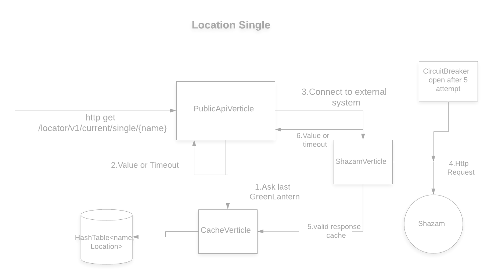

= Cisco-task

image:https://img.shields.io/badge/vert.x-4.0.3-purple.svg[link="https://vertx.io"]

This application was generated using http://start.vertx.io

== Building

To launch your tests:
```
./mvn clean test
```

To package your application:
```
./mvn clean package
```

To run your application:
```
cd target
java -jar cisco-task-1.0-fat.jar
```

== Design



To develop the task it is used Vert.x toolkit creating a non-blocking
reactive solution. Every verticle (PublicApiVerticle, ShazamVerticle, CacheVerticle)
communicate each other with message passing through an EventBus, all the communication is async. Because the external service Shazam is not in healthy
state I decided to ask for the value first in a Cache (CacheVerticle) and the same time ask Shazam through ShazamVerticle for the latest location.
That means the system is more reactive but it could have value for location old, that I think it is not the issue because the system is unhealthy state anyway and it should be only a temporary state until Shazam become healthy again. As consequence the first attempt will return an error (cache-miss), but the system will adapt fast when we will get the first valid response from Shazam, that will be cached.

== Improvement
==== Design

Improvement could be having cache invalidation
according to some rule (when a value can be considered valid?),
switch to a cache first only when the system is in degraded state for example it could be implemented with
a circuit breaker that signal to switch to adaptive cache when it opens the circuit. PublicApiVerticle
has a timeout of 1 seconds so if ShazamVerticle doesn't respond there will be a timeout and 504 error but
ShazamVerticle will try concurrently to connect to Shazam to get the latest location and cache it.

=== Test
It was tested only the PublicApiVerticle due to the nature of external system unpredictability that would require a chaos testing instead of integration test. That would require at least a Stab for the external system, and some library for chaos testing to inject the failure (ClusterFk Chaos Proxy per example), but I think it would complicate too much the task.

